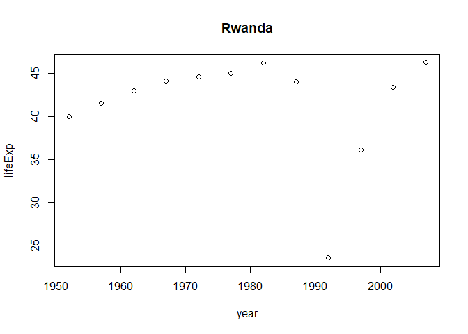
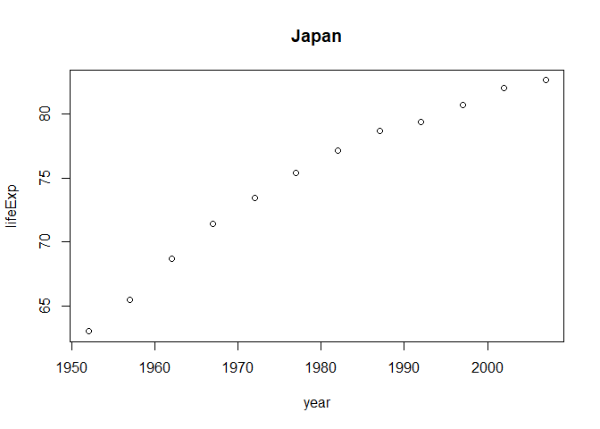

An exploration of the gapminder dataframe
================

In this document, we will be exploring the `gapminder` dataset. To load the `gapminder` dataset, we write

``` r
library(gapminder)
```

Exploring the gapminder dataset
-------------------------------

The function `summary` provides some basic analysis of the dataset

``` r
summary(gapminder)
```

    ##         country        continent        year         lifeExp     
    ##  Afghanistan:  12   Africa  :624   Min.   :1952   Min.   :23.60  
    ##  Albania    :  12   Americas:300   1st Qu.:1966   1st Qu.:48.20  
    ##  Algeria    :  12   Asia    :396   Median :1980   Median :60.71  
    ##  Angola     :  12   Europe  :360   Mean   :1980   Mean   :59.47  
    ##  Argentina  :  12   Oceania : 24   3rd Qu.:1993   3rd Qu.:70.85  
    ##  Australia  :  12                  Max.   :2007   Max.   :82.60  
    ##  (Other)    :1632                                                
    ##       pop              gdpPercap       
    ##  Min.   :6.001e+04   Min.   :   241.2  
    ##  1st Qu.:2.794e+06   1st Qu.:  1202.1  
    ##  Median :7.024e+06   Median :  3531.8  
    ##  Mean   :2.960e+07   Mean   :  7215.3  
    ##  3rd Qu.:1.959e+07   3rd Qu.:  9325.5  
    ##  Max.   :1.319e+09   Max.   :113523.1  
    ## 

We can see that `gapminder` provides data on population, gpd, and life expectancy for a number of countries, recorded over a number of years from 1952-2007. Among all countries and all years, the minimum life expectancy was 23.60 years, while the maximum life expectancy was 82.60. We can also obtain this information by the `max` and `min` functions on the `lifeEXP` column:

``` r
min(gapminder$lifeExp)
```

    ## [1] 23.599

``` r
max(gapminder$lifeExp)
```

    ## [1] 82.603

Also useful is the `str` function.

``` r
str(gapminder)
```

    ## Classes 'tbl_df', 'tbl' and 'data.frame':    1704 obs. of  6 variables:
    ##  $ country  : Factor w/ 142 levels "Afghanistan",..: 1 1 1 1 1 1 1 1 1 1 ...
    ##  $ continent: Factor w/ 5 levels "Africa","Americas",..: 3 3 3 3 3 3 3 3 3 3 ...
    ##  $ year     : int  1952 1957 1962 1967 1972 1977 1982 1987 1992 1997 ...
    ##  $ lifeExp  : num  28.8 30.3 32 34 36.1 ...
    ##  $ pop      : int  8425333 9240934 10267083 11537966 13079460 14880372 12881816 13867957 16317921 22227415 ...
    ##  $ gdpPercap: num  779 821 853 836 740 ...

We see that data was recorded from 142 countries, every 5 years.

Suppose we want to find which country, and in what year, the minimum/maximum life expectancy above was. We can use the `which` function to achieve this.

``` r
min_country = gapminder[which.min(gapminder$lifeExp),]
min_country
```

    ## # A tibble: 1 x 6
    ##   country continent  year lifeExp     pop gdpPercap
    ##   <fct>   <fct>     <int>   <dbl>   <int>     <dbl>
    ## 1 Rwanda  Africa     1992    23.6 7290203      737.

``` r
max_country = gapminder[which.max(gapminder$lifeExp),]
max_country
```

    ## # A tibble: 1 x 6
    ##   country continent  year lifeExp       pop gdpPercap
    ##   <fct>   <fct>     <int>   <dbl>     <int>     <dbl>
    ## 1 Japan   Asia       2007    82.6 127467972    31656.

Our conclusion is that Rwanda in 1992 had the lowest life expectancy, while Japan in 2007 had the highest life expectancy.

Including Plots
---------------

Let us visualise how the life expectancy of Rwanda and Japan, respectively, evolves over the years sampled in the data. The relevant data `year` and `lifeEXP` are columns 3 and 4 of `gapminder`.

``` r
Rwanda_data_location = which(gapminder$country == "Rwanda")
Japan_data_location = which(gapminder$country == "Japan")
Rwanda = gapminder[Rwanda_data_location, 3:4]
Japan = gapminder[Japan_data_location, 3:4]
```

Now we plot.

``` r
plot(Rwanda, main = "Rwanda")
```



``` r
plot(Japan, main  = "Japan")
```



We observe that the long term trend is an increase in life expectancy for both countries, however an event in Rwanda in the early 1990's caused a sudden drop in life expectancy there (this event being well-known in the literature).
